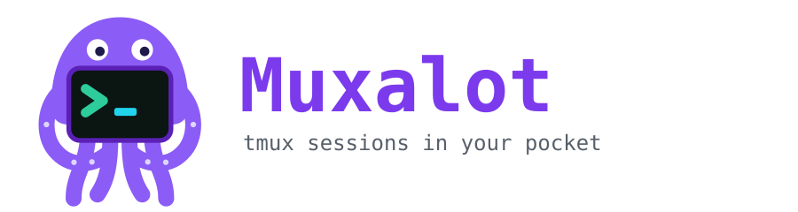

<p align="center"></p>

Open source under the [MIT License](LICENSE). Website: <https://muxalot.com>. Source and issues: <https://github.com/muxalot/muxalot>. Play Store testers: [join the closed test](https://play.google.com/apps/testing/dev.muxalot.pro) / [Play listing](https://play.google.com/store/apps/details?id=dev.muxalot.pro)

Remote terminal for Android, streamed from a Linux server. Sessions are tmux sessions, so they survive disconnects; each tab is one session.

```
Android app (Compose)                         Linux server
 xterm.js (render) + native key capture  <->  Caddy (TLS) -> muxalot-agent (Go, 127.0.0.1:8787) -> PTY -> tmux
```

## Status

| Part | State |
|---|---|
| `agent/` | Built and tested (`go test ./...`): pairing, signed-request auth, replay/forgery rejection, rate limiting, path-traversal/symlink checks, upload limits, tmux persistence across a dropped connection, clipboard. |
| `app/` | Working Android app: terminal, tabs, clipboard, files, multi-server. No automated tests yet. |

## Auth: public/private keys

- On pairing, the phone generates an **ECDSA P-256 key pair in the Android Keystore** (the private key never leaves the device). Only the public key is sent to the server.
- The agent stores public keys only (`state.json`). There is no bearer token or password to steal.
- Every request (including the WebSocket upgrade) carries
  `Authorization: Sig id="<device>", ts="<unix>", nonce="<b64url>", sig="<b64 DER>"`
  signed over `"muxalot-v1\nMETHOD\nHOST\nREQUEST_URI\nts\nnonce"`.
  Timestamps must be within 60 s and each nonce works once, so captured headers can't be replayed. The phone clock must be roughly correct.
- Pairing codes are single use, expire in 10 minutes, and failed attempts are rate limited per IP (10 per 15 min). Unauthenticated requests get a bare 404.
- Revoke a lost phone: `muxalot-agent revoke <id>`. Admins can also register a key directly: `muxalot-agent add-key --name laptop @pubkey.b64` (base64 X.509 SPKI, P-256).

## Server setup

Requires Linux with `tmux` and a domain for TLS. Install the latest release (verifies its checksum, asks which Unix user to run as, creates that user if missing, installs and starts the systemd unit):

```sh
curl -fsSL https://raw.githubusercontent.com/muxalot/muxalot/main/deploy/install.sh | sudo sh
muxalot-agent proxy --type caddy --domain tty.example.com    # or nginx, apache: prints a reverse-proxy snippet
sudo -u <that user> muxalot-agent pair --url https://tty.example.com     # QR + one-time code; just `muxalot-agent pair ...` if it's you
```

The installer prompts for the user, defaulting to the account that ran `sudo` (or `muxalot-agent` when there is none). Root is refused. Pass `--user` to skip the prompt.

To build from source instead: `git clone https://github.com/muxalot/muxalot && cd muxalot/agent && go build -o muxalot-agent . && sudo ./muxalot-agent install`.

### Verify a release

`install.sh` checks the SHA-256 (corruption only) and, when GitHub CLI 2.49+ is installed, the build attestation that proves the binary came from this repo's release workflow. To check by hand, or to inspect the script before running it:

```sh
gh attestation verify muxalot-agent-linux-amd64 --repo muxalot/muxalot
curl -fsSLO https://raw.githubusercontent.com/muxalot/muxalot/v0.2.0/deploy/install.sh   # pin a tag, read it, then: sudo sh install.sh
```

Any TLS reverse proxy works (Caddy, nginx, Apache). It must pass WebSocket upgrades, must not rewrite or strip the request path (the signature covers it), must send `X-Forwarded-For`, and must not buffer file streams or cap uploads too low. `muxalot-agent proxy` prints a snippet that does all of this.

### Install options

`install` (and `install.sh`, which passes its arguments on) accepts:

| Flag | Default | Meaning |
|---|---|---|
| `--user` | asked on the terminal; default is the user who ran `sudo`, else `muxalot-agent` | Unix user the agent and its terminals run as. Created if missing. `root` is rejected |
| `--listen` | `127.0.0.1:8787` | Address the agent binds |
| `--files-root` | that user's home | Directory tree exposed to file upload and download |

```sh
curl -fsSL https://raw.githubusercontent.com/muxalot/muxalot/main/deploy/install.sh | sudo sh -s -- --user alice --listen 192.168.1.10:8788
```

- **Which user:** the prompt (or `--user`) picks the account whose shell every terminal gets. Your own account gives you your tmux sessions, projects and shell, and is the default when you run `sudo`. A dedicated user such as `muxalot-agent` has an empty home and its own tmux, which is the most contained choice. Root is refused by both the installer and the agent. The prompt reads from the terminal, so it works under `curl | sudo sh`; with no terminal (CI, cloud-init) the default is used silently, so pass `--user` in scripts.
- **Proxy in Docker or on another host:** loopback is only reachable by a proxy on the same host and network namespace. If your proxy runs in a container or elsewhere, bind a LAN address with `--listen` and point the proxy at it. Restrict that port with a firewall to the proxy only. The agent trusts `X-Forwarded-For` only from loopback, so behind a non-loopback proxy the per-IP pairing rate limit is shared by all clients.
- **Pairing:** run `pair` as the user the agent runs as, for example `muxalot-agent pair --url https://your.host` when that is you, or `sudo -u <that user> muxalot-agent pair …` otherwise. It must be the same user, because pairing state is stored in that user's config directory.
- **Environment:** tmux starts sessions as login shells, so your `~/.profile` and `~/.bashrc` apply and your `PATH` additions are there. If a tmux server for that user is already running, new sessions inherit its environment. Only when the service itself starts the tmux server do sessions lack desktop-session variables such as `XDG_RUNTIME_DIR`, `DBUS_SESSION_BUS_ADDRESS` (so `systemctl --user` fails) and `SSH_AUTH_SOCK`.

The bundled `deploy/Caddyfile` reads these environment variables:

| Variable | Meaning |
|---|---|
| `MUXALOT_DOMAIN` | Public hostname Caddy serves, e.g. `tty.example.com` |
| `MUXALOT_AGENT` | Agent address to proxy to, e.g. `127.0.0.1:8787` (must match the agent's `--listen`) |
| `CLOUDFLARE_API_TOKEN` | Cloudflare API token for DNS-01 TLS. Only needed with the bundled `(cloudflare)` snippet; use your own `tls` block otherwise |

Recommended `~muxalot-agent/.tmux.conf`: `set -g mouse on` (swipe-to-scroll in the app maps to tmux wheel events). The agent sets `set-clipboard on` itself.

Files: uploads/downloads are confined to `--files-root` (default: the agent user's home), symlink-safe, size-capped by `--max-upload-mb`. New uploads are created `0600`. The confinement guards the file endpoints, not a paired device: a paired device already has a shell as the agent's user.

## Android app

Open `app/` in Android Studio (the Gradle wrapper isn't included; Studio creates one, or run `gradle wrapper`). minSdk 26.

- **Terminal**: xterm.js (MIT, bundled in `assets/`) renders; a native invisible view owns the soft keyboard (no suggestions or autocorrect), so vi, Ctrl-C etc. behave. Extra-keys row: Esc, Tab, sticky Ctrl/Alt, arrows (auto-repeat), ^C ^D ^Z, `| ~ / - _`, Home/End/PgUp/PgDn/Del, F1-F12. Hardware keyboards work.
- **Tabs**: one per tmux session. `+ Tab` creates or attaches; closing offers Detach (keeps running) or Kill.
- **Reconnect**: exponential backoff, plus an immediate retry when the network changes. Connections only live while the app process is alive; tmux makes the reattach seamless.
- **Clipboard**: OSC 52 from tmux/vim goes to the phone clipboard; long-press-drag selects and copies; the menu has Paste, "Send clipboard to server" (tmux buffer) and "Copy server clipboard".
- **Files**: browse, upload (system picker), download (system save dialog).
- **Multi-server**: saved list, each server with its own Keystore key.
- **Settings**: optional app lock (asks for the phone's screen lock on open, whenever the screen turns off, and after a minute in another app), and "Allow screenshots" (off by default in release builds: hides the app from screenshots, recording and recents).

## Desktop app (Linux)

A small [Wails](https://wails.io) app (Go + a system webview running the same xterm.js). Go holds the device key, signs requests and owns the network connection; the page only draws the terminal and calls a short, fixed list of methods. Sessions are tmux tabs, same as the phone app, plus a file browser (download/upload through native file dialogs).

Build (needs Go, `libgtk-3-dev`, `libwebkit2gtk-4.1-dev`; running it needs `libwebkit2gtk-4.1`):

```
make desktop            # dist/muxalot-desktop-linux-amd64
make desktop-test       # vet + tests; the end-to-end test builds and runs the real agent (needs tmux)
```

On start it checks that a graphical session and a D-Bus session bus exist, and stops with a list of what is missing if not (`muxalot-desktop --check` runs only that check). If the window never finishes loading (usually a WebKitGTK/GPU problem) it exits after 20 s with a hint: try `WEBKIT_DISABLE_DMABUF_RENDERER=1 WEBKIT_DISABLE_COMPOSITING_MODE=1`. On Linux the app hides `.woff`/`.woff2` system fonts from its own process (they are never visible to other programs): Debian/Ubuntu's `fonts-opendyslexic` installs such files, fontconfig then picks them for every font request, and WebKitGTK's page thread spins at 100% CPU so the window never loads. A missing `libwebkit2gtk-4.1` or GTK3 can't be reported by the app itself: the system loader stops the program first and prints `error while loading shared libraries`, which names the package to install. The binary is dynamically linked, so build it on (or for) a system no newer than the one that runs it.

Pair: run `muxalot-agent pair --url https://your.host` on the server, then enter the URL and code (or paste the `muxalot://pair` link into the URL field). Pick where the device key lives: the OS keyring (Secret Service / Keychain), or a passphrase-protected file (argon2id + XChaCha20-Poly1305) asked for at launch. There is no silent fallback from one to the other. The key is software-held, not hardware-bound; forget a lost machine with `muxalot-agent revoke <id>` on the server.

Shortcuts: Ctrl+Shift+C copy selection, Ctrl+Shift+V paste, Ctrl+`+` / `-` / `0` zoom. The terminal asking to set your clipboard (OSC 52) always needs a click on Copy.

Not in the desktop app yet: QR pairing, color themes, custom key shortcuts, tmux clipboard sync, auto-update, installers, macOS/Windows builds (untested).

## Wire protocol (WebSocket `/ws?session=NAME&cols=N&rows=N`)

Binary frames are raw terminal bytes both ways. Text frames are JSON: client `{"t":"resize","cols","rows"}`, `{"t":"clip_set","text"}`, `{"t":"clip_get"}`, `{"t":"ping"}`; server `{"t":"clip","text"}`, `{"t":"pong"}`, `{"t":"exit"}`.
REST (all signed): `GET /sessions`, `DELETE /sessions/{name}`, `GET /ls?path=`, `GET /files?path=` (Range supported), `PUT /files?path=[&overwrite=1]`. Unsigned: `POST /pair {code,name,pubkey}`.

## Support the project

Muxalot is free and stays free. If it saves you time, you can support development with GitHub Sponsors or with the supporter edition ("Muxalot Pro") on Google Play, currently in closed testing. Testers: [join the test](https://play.google.com/apps/testing/dev.muxalot.pro), then install from the [Play listing](https://play.google.com/store/apps/details?id=dev.muxalot.pro). The pro build comes from the same source in this repo (`pro` flavor: `gradle :app:assembleProDebug`) and adds shortcut export/import, terminal color themes, and multi-file upload with progress bars. Everything else is identical to the free build.

<a href="https://www.buymeacoffee.com/luckyedward"></a>

<a href="https://www.buymeacoffee.com/luckyedward"></a>

## License

muxalot is released under the [MIT License](LICENSE). Contributions are welcome, see [CONTRIBUTING.md](CONTRIBUTING.md).

Third-party components: Termux's terminal libraries were **not** used: `TerminalSession` is `final` and bound to a local process, and the Termux repo is GPLv3-only. xterm.js is MIT, OkHttp and zxing-android-embedded are Apache-2.0. Go deps: gorilla/websocket (BSD-2), creack/pty (MIT), go-qrcode (MIT). Desktop app: Wails v3 (MIT), zalando/go-keyring (MIT), golang.org/x/crypto (BSD-3).

## Known limitations / next steps

- Security review with findings and a threat model: [SECURITY_ANALYSIS.md](SECURITY_ANALYSIS.md).
- Upload/download bodies are protected by TLS and the signed request line, but the body itself isn't signed.
- The server certificate is validated against the system CA store (no pinning), which suits Caddy with Let's Encrypt.
- Not yet done: background keep-alive service, scrollback search, pinch-zoom, Play Store polish (icon, onboarding).
